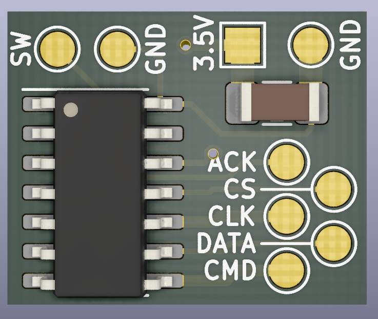
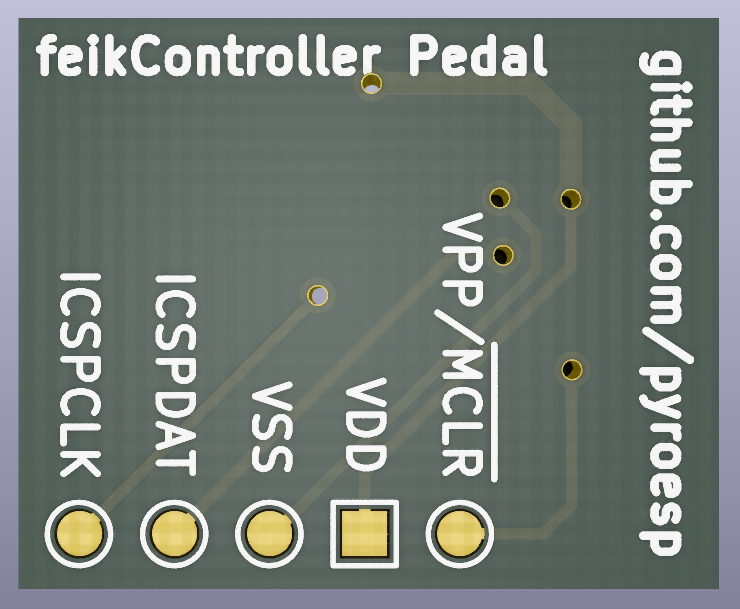
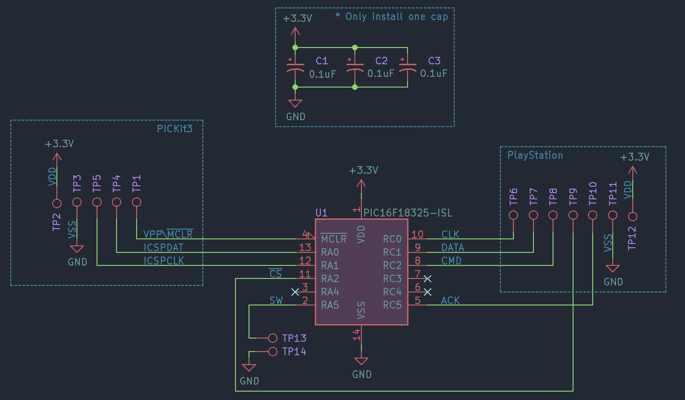

# feikController

feikController is a PIC16F18325 emulating a PlayStation 1 controller.  
I wanted to make this into a library but it's too device specific.    

## Disclaimer

This has been tested on my PlayStation 1 and it seems to be working fine.  
However, I am not responsible if for some reason your PlayStation gets damaged by using or installing this.  

You use this at your own risk.  

## Why

The original idea for feikController came from the fact you can use a second controller to play Time Crisis.  
You can use that second controller to hide/reload by pressing on the buttons with your foot, so it's just like the pedal button on the arcade games.  

I recently made the PlayStation 1 reset mod with the 16F18325 so I was confident I could emulate a controller.  

## Pedal project

The pedal project uses a pedal button to send an X button press to the PlayStation.  
Here's a demo of the pedal controller :  

You can find [a playlist](https://www.youtube.com/watch?v=J5fQKmc8AMY&list=PLGaX4WJGgdHhcbQUQQJR6zFgzyka-xVOa) of me struggling to make this pedal controller.  
  
Take a look at the source if you want to learn more about it. I've tried to add comments to the code.  

I'd like to point out that the code as it is now is overkill for just a pedal that only works for Time Crisis.  
**It's more a proof of concept on making a PlayStation 1 controller.**  

I also made it so you can use either normal open or normal close button with the pedal. You just need to change the button defines a bit, see the source files.

**Note:** You could very well use this 

## Schematic and PCB

The schematic and PCB is pretty much the same as the reset mod I did for the PlayStation 1, just a few changes and more pads for the button.  

  
  
  

## License

Attribution-ShareAlike 4.0 International, see license file for more info
